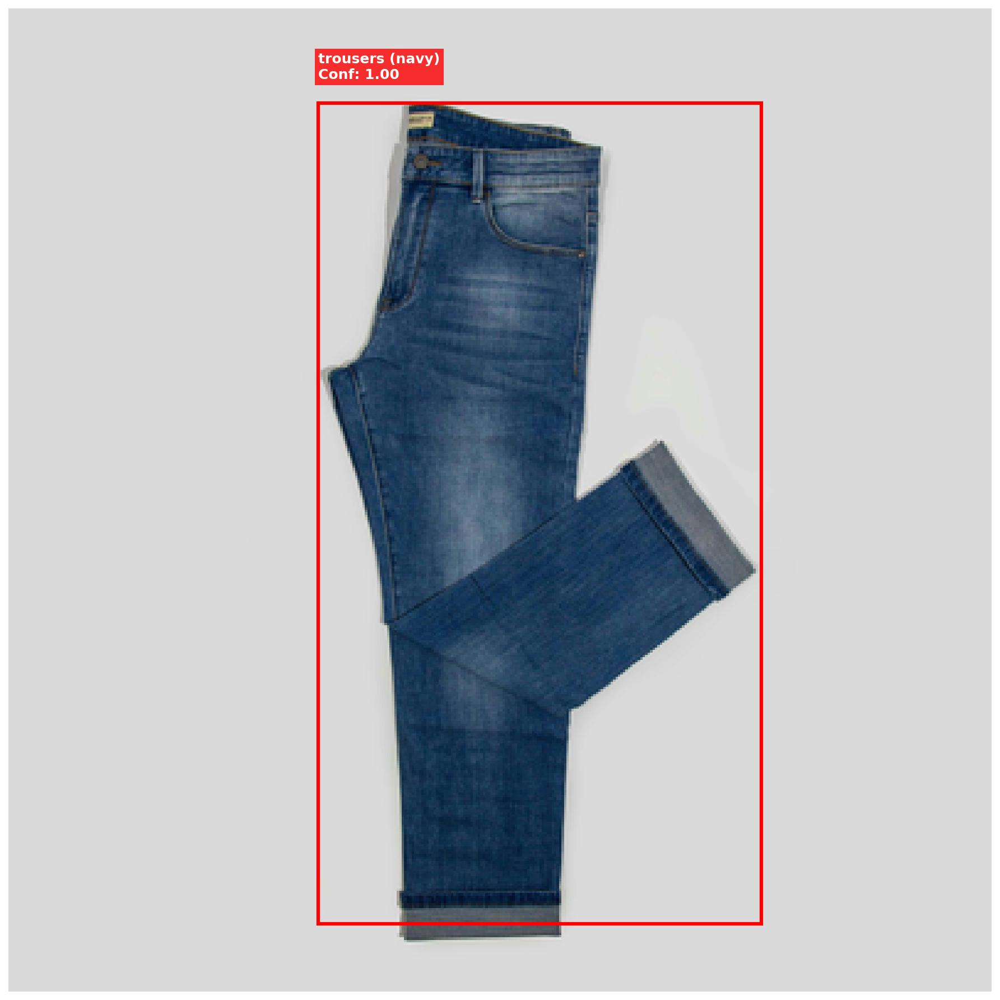
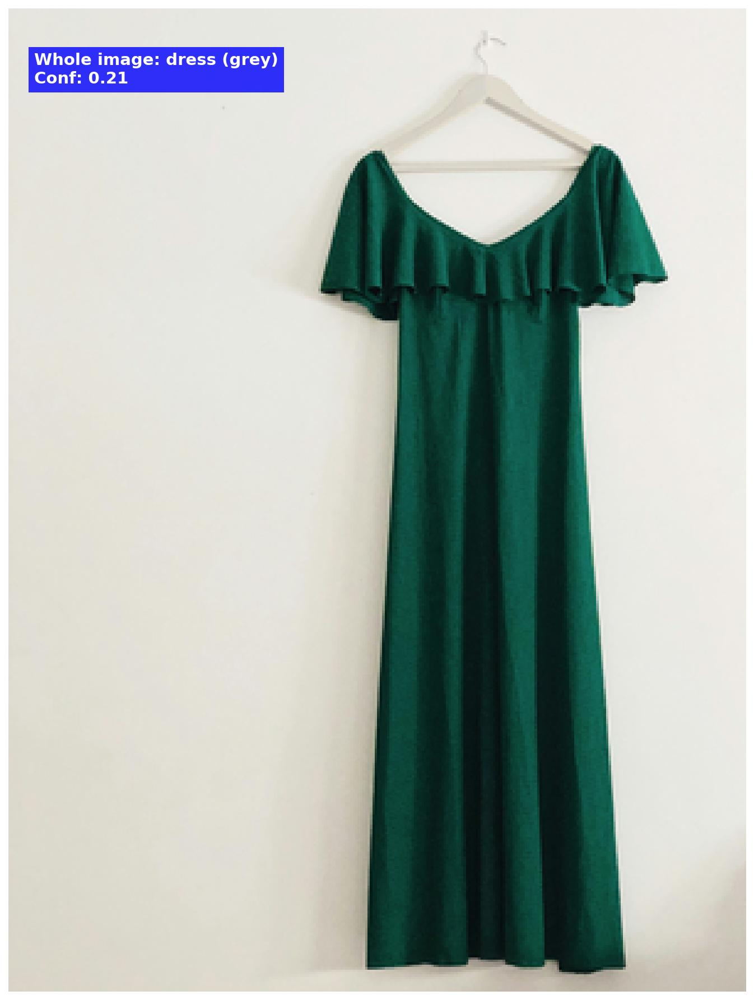
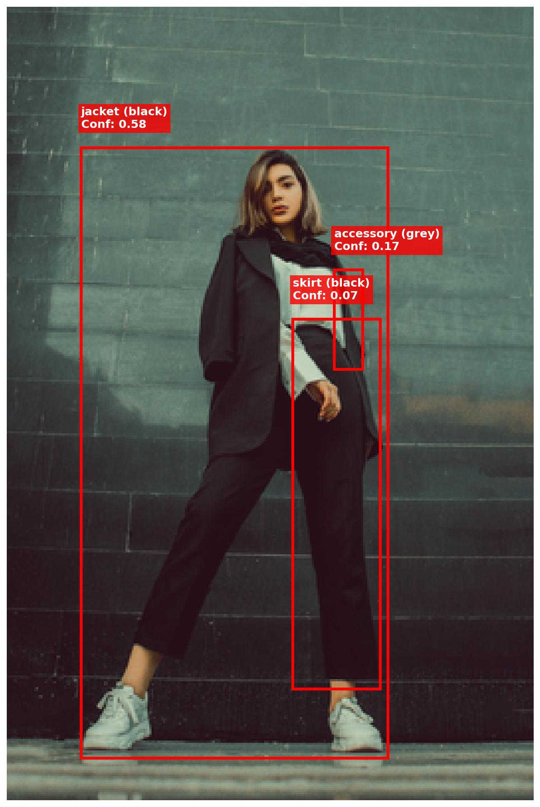
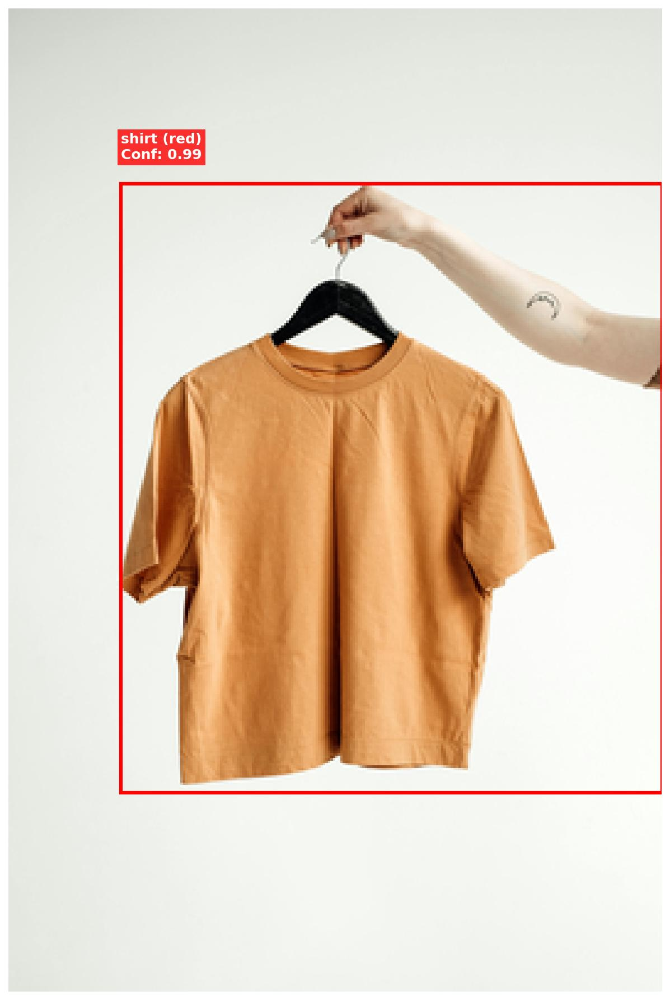
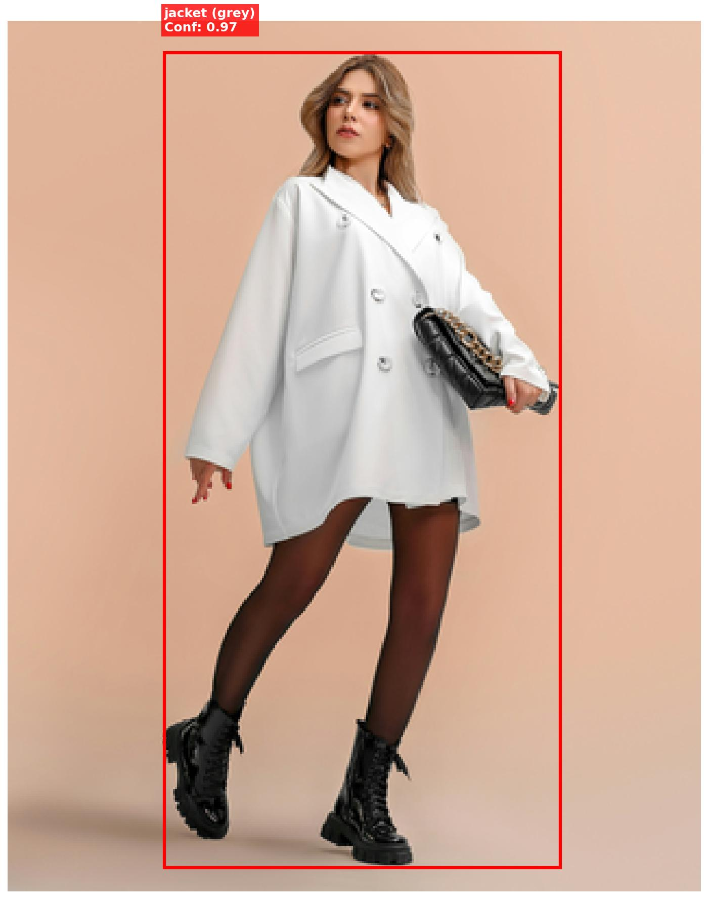
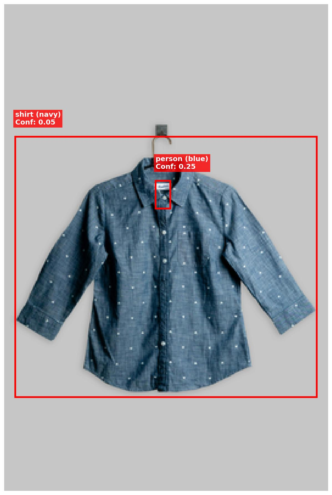
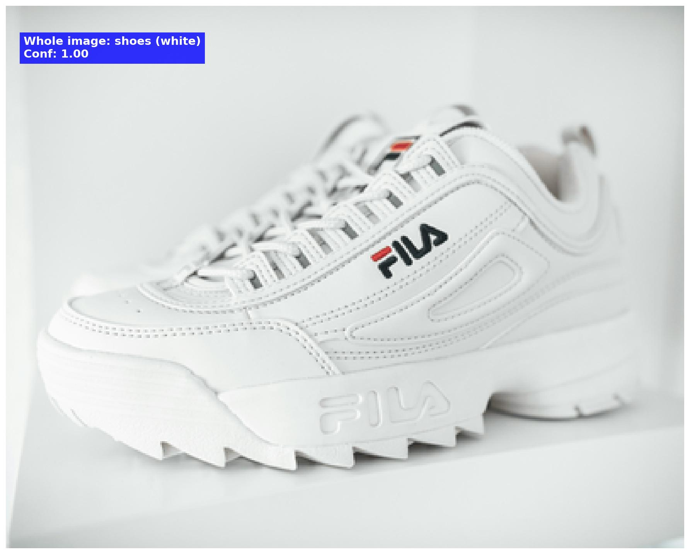

# Whering Product Catalog Tagger

A lightweight image processing pipeline for detecting, classifying, and extracting colour information from clothing items in images. Built for CPU-only execution with pre-trained models, optimised for speed whilst maintaining reasonable accuracy.

## Overview

This pipeline processes fashion/clothing images through three stages:
1. **Object Detection** - Locates people/clothing regions using DETR
2. **Classification** - Categorises garment types using ResNet-50
3. **Colour Extraction** - Identifies dominant colours via median RGB analysis

**Output:** Structured JSON containing bounding boxes, garment categories, colours, and confidence scores.

## Quick Start

### Installation
```bash
# Create environment
conda create -n whering python=3.14
conda activate whering

# Install dependencies
pip install -r requirements.txt
```

### Run Pipeline
```bash
# Process images
python src/main.py

# Generate annotated visualisations
python src/visualise.py
```

**Expected runtime:** 1-2 minutes for 21 images on CPU

## Approach

### Object Detection (DETR)
- **Model:** facebook/detr-resnet-50 - trained on the COCO dataset
- **Strategy:** Detect "person" regions as a proxy for clothing areas
- **Why:** COCO dataset lacks clothing-specific categories (shirt, dress, trousers)
- **Limitation:** Works well for lifestyle/model shots; struggles with pure product images

### Classification (ResNet-50)
- **Model:** microsoft/resnet-50 (ImageNet-trained)
- **Strategy:** Classify cropped regions, filter to clothing-only categories
- **Categories:** shirt, trousers, dress, jacket, shoes, sweater, skirt, coat, accessory
- **Why:** ImageNet contains ~30 fashion-related labels; fast on CPU

### Colour Detection
- **Method:** Median RGB of central 50% of detected region
- **Rationale:** Simple, fast, avoids edge artefacts (shadows, background)
- **Limitation:** Struggles with patterns, multi-coloured items (see TODOs in code)

## Results

### Sample Outputs


*Blue jeans detected with 100% confidence*


*Green dress detected as grey dress with a confidence of 21% - Colour mismatch is due to detection failure meaning central pixels are not the main body*


*Person in whole outfit with multiple detections - overall good detection of black jacket with 58% confidence, other detections are errors*


*Orange shirt detected with 99% confidence - Confidence good, colour slightly off possibly due to bad colour threshold optimisation*


*Person in white jacket detected with 97% confidence - detected as grey possibly due to shading*


*Blue shirt detected with 5% confidence - Very low confidence, colour detection good*


*White trainers detected using whole image at 100% confidence*

### Accuracy Assessment

**Detection (DETR):**
- Successfully detected items/people in 15/21 images (71%)
- 6 images with no detections and therefore fallback to whole-image classification
- False negatives: product-only shots without people

**Classification (ResNet-50):**
- Roughly 23/29 correct classifications on detected regions (79%)
- Whole person bounding boxes with only single classifications lead to most prominent item being classified rather than individual items
- Common errors: Small detections lead to bad classifications - very little information to go off of. Additionally specific items which the model clearly has not been trained to recognise (Images 3 and 16)
- Works best on clear, well-lit images. 
- Downscaling of the images could be played around with more to balance between speed and classification accuracy - currently very fast but accuracy and confidence could be improved

**Colour Extraction:**
- 60-70% accuracy for solid colours
- Only factors in solid colours currently, patterns/texture colours will be averaged and taken as a whole
- Background bleed reduced by focusing on central 50% of bbox
- Main fallback is when classified object is not in the centre of the detection bounding box

### Known Limitations

1. **Object detection fails on product shots** - DETR trained on people, not isolated garments - specific models based on clothing would be much more applicable 
2. **No pattern/multi-colour detection** - median approach assumes single dominant colour
3. **ImageNet category mismatch** - Categories like "jersey" map badly to fashion terms and could do with expansion, especially when working with real-world clothing
4. **CPU-only inference** - Processing time scales linearly (unsuitable for real-time at scale)

## Trade-offs Made

### 1. DETR with "person" proxy vs fashion-specific detector
**Decision:** Use COCO-trained DETR detecting "person" regions  
**Why:** Fashion-specific models (e.g., DeepFashion2-YOLO) had compatibility issues and DETR is known to be reliable and fast  
**Trade-off:** Detections on product only are often missed as people are not included, however whole image classifications for product only are often sufficient
**Production approach:** Deploy fashion-trained model with a large number of clothing categories - specific for our use case

### 2. Simple median colour
**Decision:** Median RGB of central region  
**Why:** Other methods were attempted (k-means) however struggled with background filtering - median is robust and fast.   
**Trade-off:** Cannot detect patterns or multiple colours, also miss-labels objects where the object found is not at the centre of the detection box
**Production approach:** Colour segmentation with thresholding (see TODOs in `colour.py`)

### 3. Image downscaling
**Decision:** Downscaled images on import so the lowest pixel dimension was 400px (keeping aspect ratio)
**Why:** Importing images at full resolution is incredibly slow
**Trade-off:** Processing time for full 21 images before downscaling was around 20 minutes, however the classiciation and detection confidences were increased - now around 1 minute for the full set.
**Production approach:** GPU inference servers with batching would allow for faster processing so image downscaling to this extent may not be an issue but would still need testing. 

## Thoughts on designing for scale

### Scaling to 10k -> 100k -> 1M images/day

**10k/day**
- Current CPU setup would likely handle this
- Main change: separate upload from processing so users get instant response (or at least appear to)
- Queue uploaded images, process in background, notify when done

**100k/day**
- **GPU acceleration** - Move from CPU to GPU inference (10-20x faster)
- **Batch processing** - Process multiple images together rather than one-by-one
- **Multiple workers** - Run several instances of the pipeline in parallel to share the load

**1M/day**
- **Model optimisation** - Techniques like quantisation (reducing model parameter precision) for faster inference
- **Distributed system** - Multiple machines working together

**My approach:** Delivering models at this scale is not something that I've had experience in as of yet, however my approach would be the following:

I'd start by researching production ML deployments, talk to experienced engineers about what's worked for them, and focus on getting the model optimisation right (since that's where my expertise is) whilst learning the infrastructure side.

### Monitoring Model Performance

**Drift detection:**
- Track confidence score distributions weekly
- Log low-confidence predictions (<0.3) for manual review

**Accuracy tracking:**
- Sample 100 random predictions/week for human labelling
- Compare ground truth vs predictions, track per-category accuracy
- Re-train if accuracy drops below threshold (Most likely a high accuracy as these classifications shouldn't be difficult with enough optimisation)

**A/B testing:**
- Run new model alongside production, compare outputs
- Gradual rollout on traffic over a longer period of time to ensure few changes for the user

### Validation & Error Handling

**Upload validation:**
- Check file format (JPEG, PNG only), reject others
- Verify file size and image dimensions are within a sensible range - files not excessively large, dimensions not too small
- Scan for corruption (try to load image before processing)
- Rate limiting - Max 10 uploads/min per user

**Extraction failure handling:**
- If no detections -> return whole-image classification
- If confidence <0.3 -> flag for manual review
- If processing timeout (>30s) -> queue for retry, return placeholder
- Store failed images + error logs for debugging
- Include manual entry option - can be used later for training

### Edge Cases

**Identified edge cases:**
1. **Multiple items of clothing** - Currently finds single person, not all items on person - could locate all but would depend on what the project scope is
2. **Extreme aspect ratios** - Downscaling may distort features
3. **Very dark/bright images** - Colour and detection fails
4. **Similar background/clothing colouring** - Similar to point 3. but less important for colour and more for initial detection
5. **Transparent backgrounds** (e.g., product PNGs) - Background noise affects colour
6. **Occluded garments** (person partially visible) - Bbox may include non-clothing

**Handling strategy:**
- Pre-processing: Brightness/contrast normalisation, aspect ratio checks
- Post-processing: Confidence thresholds, multi-item merging logic
- Fallbacks: Default to "unknown" category/colour rather than guessing - hand to the user to fill out manually

## File Structure
```
├── data/
│   ├── images/          # Input images (21 samples)
│   └── output.json      # Structured extraction results
├── output/
│   └── annotated/       # Visualised bounding boxes + labels
├── src/
│   ├── main.py          # Pipeline orchestration
│   ├── detector.py      # DETR object detection
│   ├── classifier.py    # ResNet classification + resize util
│   ├── colour.py        # Median colour extraction
│   └── visualise.py     # Generate annotated images
├── requirements.txt
└── README.md
```

## Future Improvements

See TODO comments throughout code for detailed improvements. Key priorities:

1. **Fashion-specific detector** - True clothing detection via fashion based detector
2. **Multi-colour support** - Segmentation-based colour extraction (see `colour.py`)
3. **Pattern recognition** - Classify stripes, prints, solid
4. **GPU inference** - 10-20x speedup for production deployment
5. **Confidence calibration** - Better threshold tuning per category

## Technical Details

- **Python:** 3.14
- **Key libraries:** transformers, torch, torchvision, PIL, numpy, matplotlib
- **Models:** 269MB total (DETR: 167MB, ResNet: 102MB)
- **Processing time:** ~1-5s per image on CPU
- **Memory usage:** ~1.2GB peak


